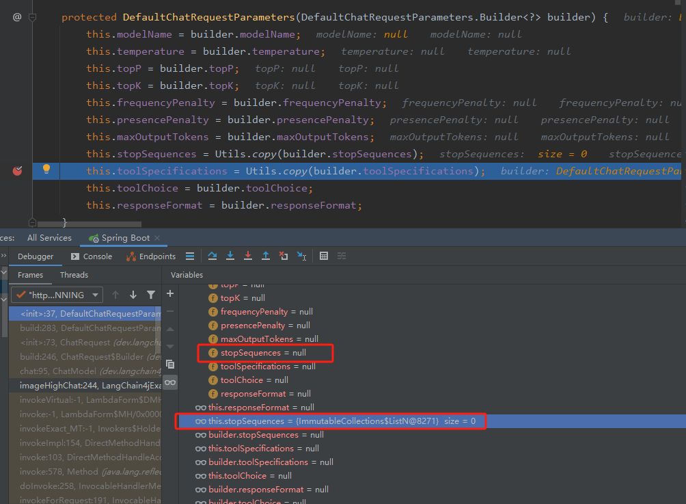
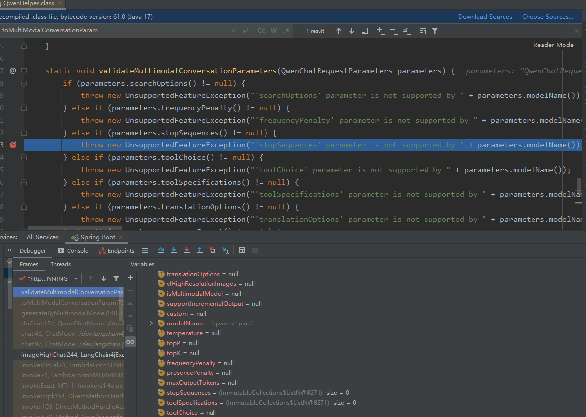

# bugs

## 'stopSequences' parameter is not supported by qwen-vl-plus

问题：在使用图片识别模型时报错

背景：
- 版本：1.0.0
- 配置：
 ```yaml
 langchain4j:
   community:
     dashscope:
       chat-model:
         api-key: sk-xxx
         model-name: qwen-vl-plus
 ```
- 代码：
```java
public String imageRecognition(@RequestParam(value = "message") String message) throws IOException {
    String imagePath = "https://xxx";
    UserMessage userMessage = UserMessage.from(TextContent.from(message),
            ImageContent.from(imagePath)
    );
    return chatModel.chat(List.of(userMessage)).aiMessage().text();
}
```

原因：
- 调用chat方法后，框架会构建ChatRequest，由于客户端没有配置parameters参数，框架会使用DefaultChatRequestParameters创建默认的ChatRequestParameters，
- 但是，在复制`stopSequences`参数时，对为null的`stopSequences`进行了初始化变成了大小为0的空集合，如图1
- 之后，在检查多模态的参数时，对`stopSequences`进行了null校验，由于之前被初始化，导致校验不通过，如图2

图1：  

图2：  



解决：
- 临时方式：复制类`DefaultChatRequestParameters`到当前项目，修改使用`Utils.copyIfNotNull(builder.stopSequences);`、`Utils.copyIfNotNull(builder.toolSpecifications);`

提交issue：[https://github.com/langchain4j/langchain4j-community/issues/189](https://github.com/langchain4j/langchain4j-community/issues/189)
