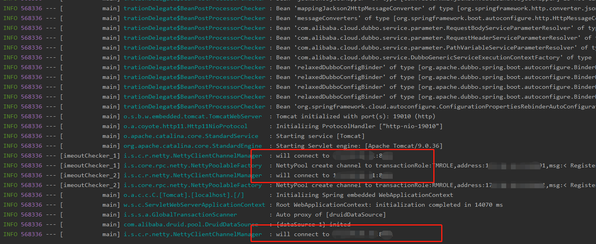
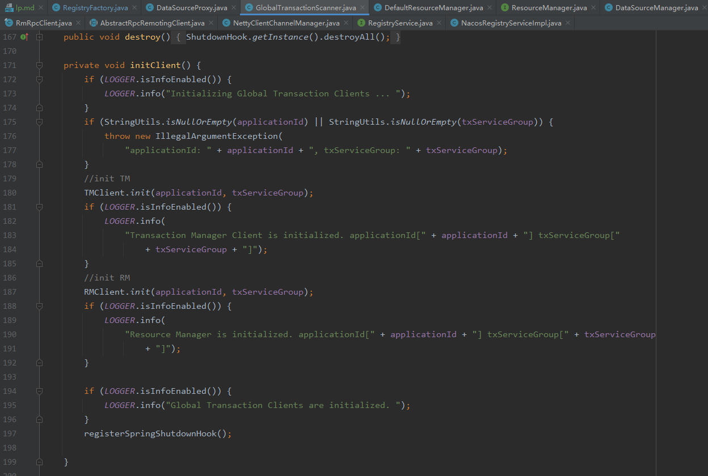
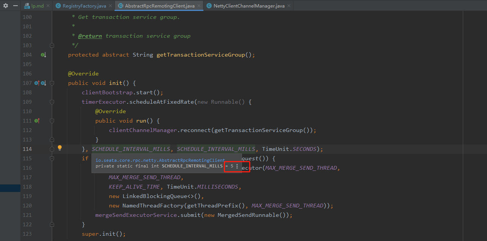
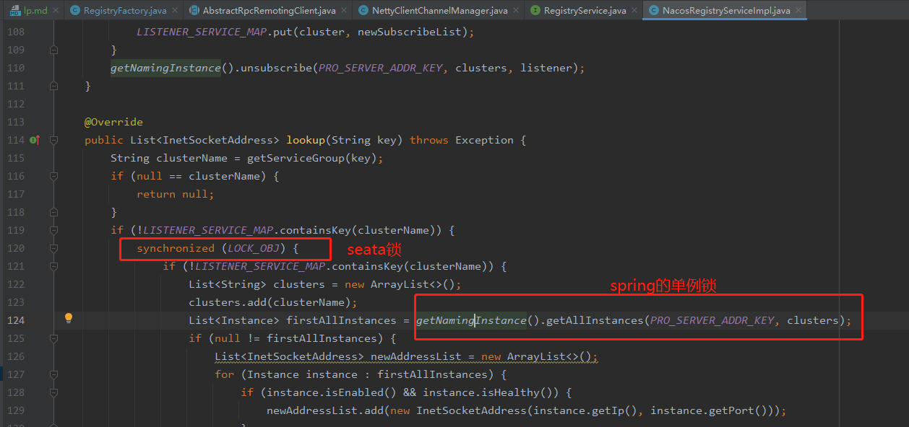
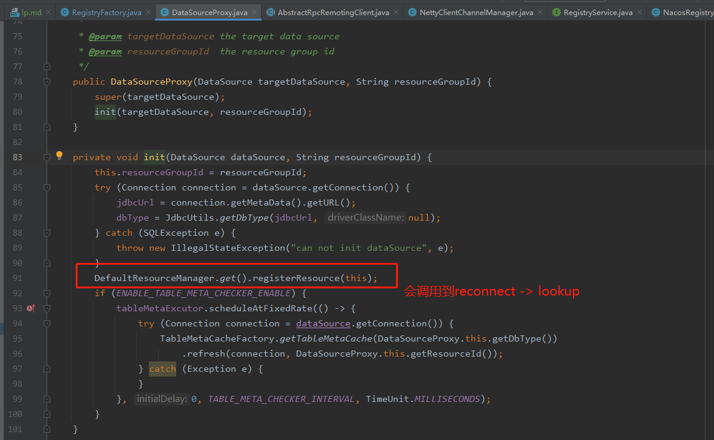
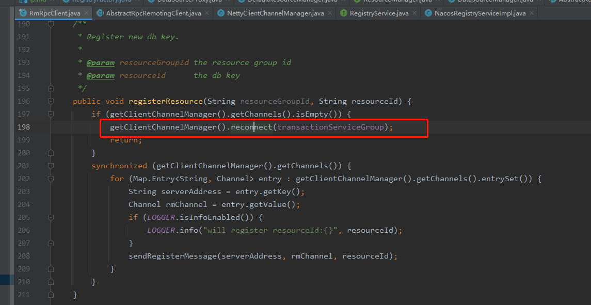
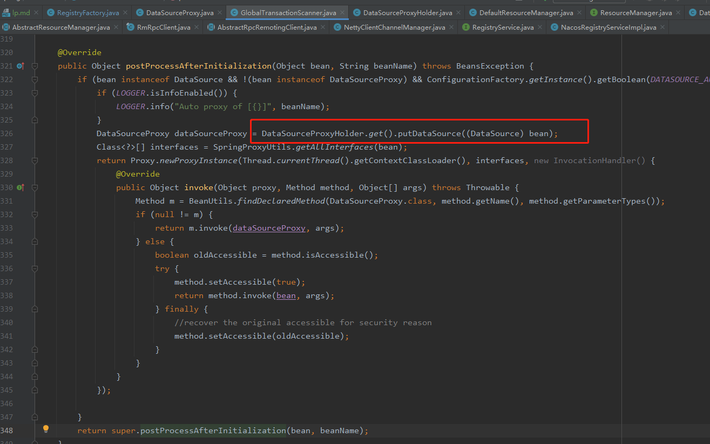
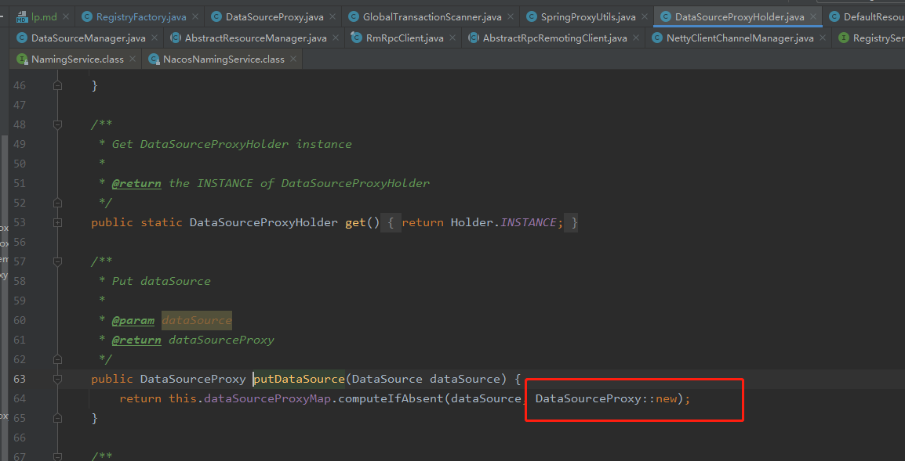

# 问题记录

## seata启动死锁
该1.0.0版本存在应用启动时seata客户端死锁导致的应用启动失败问题。官方在1.5.1及后续的版本有解决。

### 问题现象
- 应用服务在启动时会卡死在`[imeoutChecker_2] i.s.c.r.netty.NettyClientChannelManager  : will connect to xx.xx.xx.xx:xxxx`
  
    
  
- 遇到这种情况，只能重启该应用，等待是没有用的。
- 但是重启还是可能会有这种情况，运气不好起半天都起不起来，起的你怀疑人生。

### 影响服务


### 问题原因

seata的timeoutChecker定时任务线程跟应用启动主线程死锁导致的。

1. seata的GlobalTransactionScanner初始化客户端时会调用到AbstractRpcRemotingClient的init方法，该方法会启动客户端超时重连任务，1.0.0版本延迟5秒后，每5秒执行一次（后续版本延迟60秒后，每10秒执行一次）。
    
    

    
   
2. 重连任务在执行时会查找可用服务列表，会走到NacosRegistryServiceImpl的lookup，timeoutChecker线程先获取seata的LOCK_OBJ，再获取Spring的单例锁。
    
    
   
3. seata的数据源代理在执行的过程中会调用到reconnect再到lookup。
    
    
   
    

4. seata的初始化后的后置处理器，在Spring初始化bean后执行这里的逻辑，只要主线程代码走到这里就已经持有Spring的单例锁，而它后续put数据源时的new DataSourceProxy()操作又会走到去获取seata的LOCK_OBJ锁。
    
    
   
    

5. 因此，在主线程启动过程中持有了Spring的锁，又去获取seata的LOCK_OBJ锁。跟第2步的seata的timeoutChecker线程获取的LOCK_OBJ锁，再获取Spring的锁。产生了死锁
   （在1.0.0版本中，服务启动超过5秒就可能导致main线程跟timeoutChecker线程的死锁，后续的版本是60秒）。

### 解决方法

修改客户端源码，然后通过seata的spi引入

1. 修改seata的timeoutChecker线程延迟时间到60秒，跟后续版本一致，可以降低发生死锁的概率。（这个时间也可以根据服务启动时间适度调节）
```java
AbstractRpcRemotingClient.class

private static final long SCHEDULE_DELAY_MILLS = 60 * 1000L;
private static final long SCHEDULE_INTERVAL_MILLS = 10 * 1000L;

@Override
public void init() {
    clientBootstrap.start();
    timerExecutor.scheduleAtFixedRate(new Runnable() {
        @Override
        public void run() {
            clientChannelManager.reconnect(getTransactionServiceGroup());
        }
    }, SCHEDULE_DELAY_MILLS, SCHEDULE_INTERVAL_MILLS, TimeUnit.MILLISECONDS);
    if (NettyClientConfig.isEnableClientBatchSendRequest()) {
        mergeSendExecutorService = new ThreadPoolExecutor(MAX_MERGE_SEND_THREAD,
            MAX_MERGE_SEND_THREAD,
            KEEP_ALIVE_TIME, TimeUnit.MILLISECONDS,
            new LinkedBlockingQueue<>(),
            new NamedThreadFactory(getThreadPrefix(), MAX_MERGE_SEND_THREAD));
        mergeSendExecutorService.submit(new MergedSendRunnable());
    }
    super.init();
}
```

2. 按照seata后续版本的修复内容，修改注册工厂获取注册服务的单例方式。
```java
package io.seata.discovery.registry;

import io.seata.common.exception.NotSupportYetException;
import io.seata.common.loader.EnhancedServiceLoader;
import io.seata.config.ConfigurationFactory;
import io.seata.config.ConfigurationKeys;

import org.slf4j.Logger;
import org.slf4j.LoggerFactory;

import java.util.Objects;

/**
 * The type Registry factory.
 *
 * @author slievrly
 */
public class RegistryFactory {
    private static final Logger LOGGER = LoggerFactory.getLogger(RegistryFactory.class);

    /**
     * Gets instance.
     *
     * @return the instance
     */
    public static RegistryService getInstance() {
        return RegistryFactoryHolder.INSTANCE;
    }

    private static RegistryService buildRegistryService() {
        RegistryType registryType;
        String registryTypeName = ConfigurationFactory.CURRENT_FILE_INSTANCE.getConfig(
                ConfigurationKeys.FILE_ROOT_REGISTRY + ConfigurationKeys.FILE_CONFIG_SPLIT_CHAR
                        + ConfigurationKeys.FILE_ROOT_TYPE);
        try {
            registryType = RegistryType.getType(registryTypeName);
        } catch (Exception exx) {
            throw new NotSupportYetException("not support registry type: " + registryTypeName);
        }
       if (RegistryType.File == registryType) {
          return FileRegistryServiceImpl.getInstance();
       } else {
          return EnhancedServiceLoader.load(RegistryProvider.class, Objects.requireNonNull(registryType).name()).provide();
       }
//        return EnhancedServiceLoader.load(RegistryProvider.class, Objects.requireNonNull(registryType).name()).provide();
    }

    private static class RegistryFactoryHolder {
        private static final RegistryService INSTANCE = buildRegistryService();
    }
}

```


